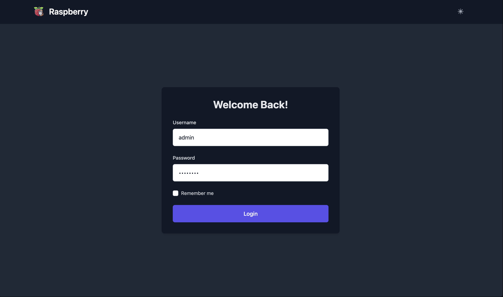
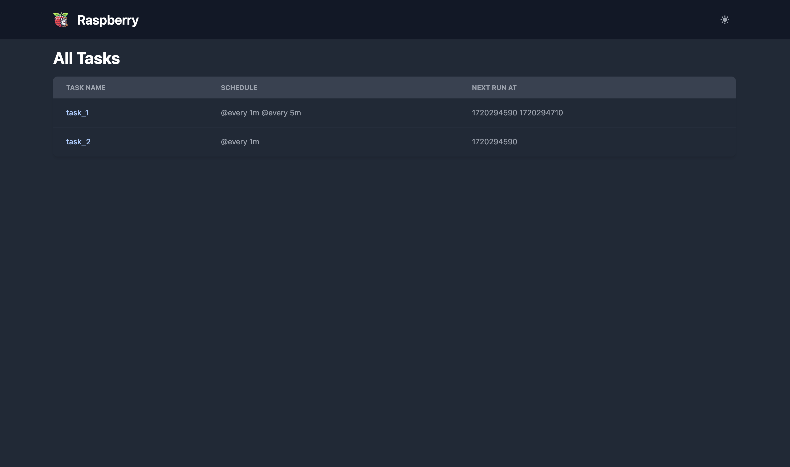
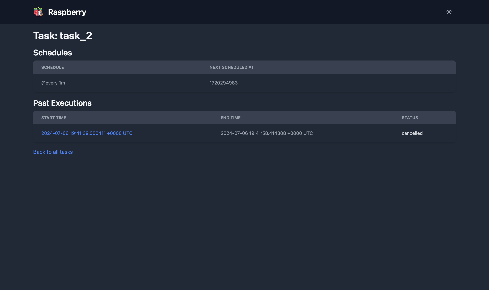
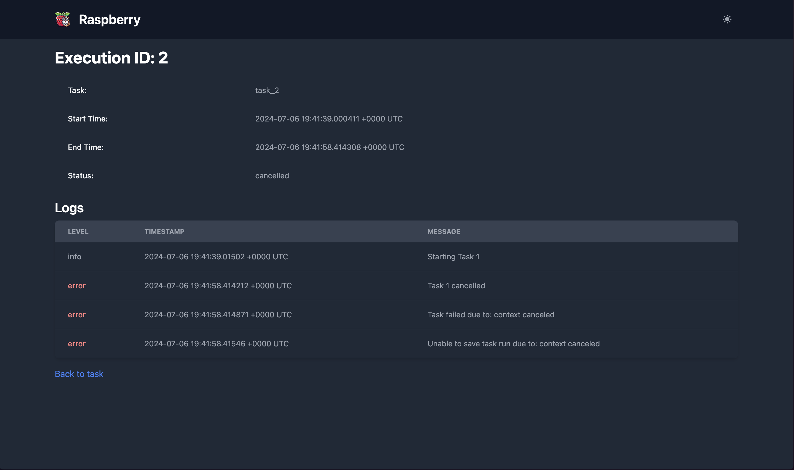
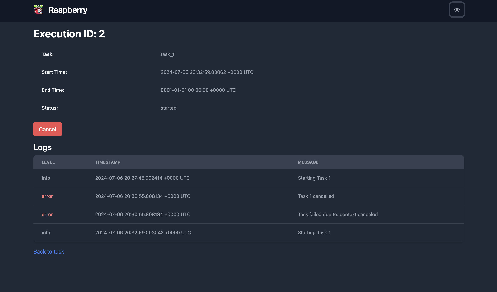
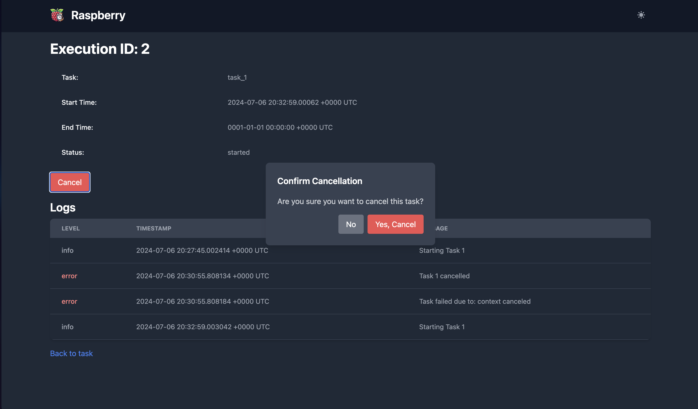
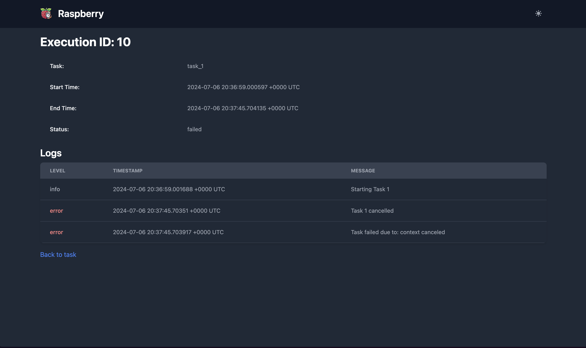
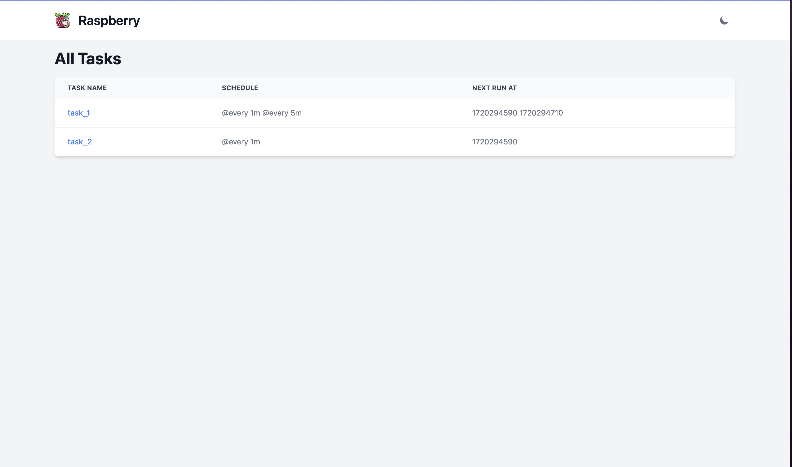

## Raspberry Task Scheduler

Raspberry is a task scheduler with a web GUI and an API, designed to make scheduling and managing tasks easy and efficient.

### Logo


### Features

- Web GUI for task management
- Native authentication support (multi-user) via cookie and API key (for web gui and for API)
- Multi DB Support
  - SQLite
  - PostgreSQL
  - MongoDB
  - Memory (Temporary; logs gets deleted on restart)
- RESTful API for integrating task management into other applications
- Support for common cron intervals and custom cron expressions
- Graceful shutdown handling
- Logging for task execution and status

### Installation

To install Raspberry, you need to have Go installed. Use the following command to get the Raspberry module:

```bash
go get github.com/ersauravadhikari/raspberry-go
```

### Getting Started

Below is an example script to demonstrate how to use Raspberry. You can find the full example in the [example/sqlite/main.go](https://github.com/ErSauravAdhikari/raspberry-go/blob/production/example/sqlite/main.go) file.

### Example Usage

#### 1. Define Task Functions

A **task** is a function that will be executed by the scheduler. The function should accept a context, parameters, and a logger.

```go
func task1(ctx context.Context, params map[string]interface{}, logger *rasberry.Logger) error {
    if err := logger.Info("Starting Task 1"); err != nil {
        return err
    }
    select {
    case <-time.After(10 * time.Minute):
        if err := logger.Success("Task 1 completed successfully"); err != nil {
            return err
        }
        return nil
    case <-ctx.Done():
        if err := logger.Error("Task 1 cancelled"); err != nil {
            return err
        }
        return ctx.Err()
    }
}

func task2(ctx context.Context, params map[string]interface{}, logger *rasberry.Logger) error {
    if err := logger.Info("Starting Task 2"); err != nil {
        return err
    }
    select {
    case <-time.After(5 * time.Minute):
        if err := logger.Success("Task 2 completed successfully"); err != nil {
            return err
        }
        return nil
    case <-ctx.Done():
        if err := logger.Error("Task 2 cancelled"); err != nil {
            return err
        }
        return ctx.Err()
    }
}
```

#### 2. Initialize the Raspberry Instance

Set up the Raspberry instance with a database connection.

```go
db, err := store.NewSQLiteDB("task_scheduler.db")
if err != nil {
    log.Fatalf("Failed to initialize SQLite: %v", err)
}
defer db.Close()

rb := rasberry.NewRaspberryInstance(db)
```

For using postgresql
```go
db, err := store.NewPostgresDB("postgres://...(conn str)...")
if err != nil {
    log.Fatalf("Failed to initialize Postgresql: %v", err)
}
defer db.Close()

rb := rasberry.NewRaspberryInstance(db)
```

##### 2.1 Authentication
If you want to add authentication then you can call the add auth function as

```go
// Add authentication
rb.AddWebOnlyPasswordAuth("admin", "password")
rb.AddAPIOnlyKeyAuth("your-api-key", "Main API Key")
```

If no user has been added, the application GUI and API will be left open to all.

Note: The authentication for web ui is handled via password auth using cookie and for api via api auth. Since each are handled independently you will need to provide both web auth and api auth params for them to be properly authenticated.

#### 3. Register Tasks and Schedules

A **schedule** is a task execution schedule with defined parameters. Register tasks and their schedules with the Raspberry instance.

```go
tsk1 := rb.RegisterTask("task_1", task1)
if err := tsk1.RegisterSchedule(map[string]interface{}{"param1": "value1"}, "@every 1m"); err != nil {
    log.Fatalf("Failed to register schedule: %v", err)
}

tsk2 := rb.RegisterTask("task_2", task2)
if err := tsk2.RegisterSchedule(map[string]interface{}{"param2": "value2"}, rasberry.RunEvery5Minutes); err != nil {
    log.Fatalf("Failed to register schedule: %v", err)
}
if err := tsk2.RegisterSchedule(map[string]interface{}{"param2": "value3"}, rasberry.RunEvery10Minutes); err != nil {
    log.Fatalf("Failed to register schedule: %v", err)
}
```

#### 4. Handle System Signals

Gracefully handle system shutdown signals to ensure all running tasks are completed or cancelled properly.

```go
// Handle system signals for graceful shutdown
sigChan := make(chan os.Signal, 1)
signal.Notify(sigChan, syscall.SIGINT, syscall.SIGTERM)

go func() {
    sig := <-sigChan
    log.Printf("Received signal: %v. Shutting down...", sig)
    rb.Shutdown()
    os.Exit(0)
}()
```

#### 5. Start the Scheduler and API Server

Initialize the task scheduler and start the API server to manage tasks and schedules.

```go
rb.InitTaskScheduler()
rb.RunAPI("8080")
```
### Predefined Run Configurations

Raspberry provides a set of predefined cron intervals to make scheduling tasks easier. These predefined configurations cover common intervals, specific times of day, and specific days of the week. You can also use custom cron expressions for more flexible scheduling.

#### Common Cron Intervals

- **RunEveryMinute**: Executes the task every minute.
- **RunEvery5Minutes**: Executes the task every 5 minutes.
- **RunEvery10Minutes**: Executes the task every 10 minutes.
- **RunEvery15Minutes**: Executes the task every 15 minutes.
- **RunEvery30Minutes**: Executes the task every 30 minutes.
- **RunEveryHour**: Executes the task every hour.
- **RunEvery2Hours**: Executes the task every 2 hours.
- **RunEvery3Hours**: Executes the task every 3 hours.
- **RunEvery4Hours**: Executes the task every 4 hours.
- **RunEvery6Hours**: Executes the task every 6 hours.
- **RunEvery12Hours**: Executes the task every 12 hours.
- **RunEveryDay**: Executes the task every 24 hours.
- **RunEveryWeek**: Executes the task every 7 days (168 hours).

#### Specific Times of Day

- **RunAtMidnight**: Executes the task at midnight (00:00) every day.
- **RunAtNoon**: Executes the task at noon (12:00) every day.
- **RunAt6AM**: Executes the task at 6:00 AM every day.
- **RunAt6PM**: Executes the task at 6:00 PM every day.

#### Specific Days of the Week

- **RunEveryMondayAtNoon**: Executes the task every Monday at noon (12:00).
- **RunEveryFridayAtNoon**: Executes the task every Friday at noon (12:00).
- **RunEverySundayAtMidnight**: Executes the task every Sunday at midnight (00:00).

Here is an example of showing you how to do this.

```go
// Register and schedule Task 1
tsk1 := rb.RegisterTask("task_1", task1)
if err := tsk1.RegisterSchedule(map[string]interface{}{"param1": "value1"}, rasberry.RunEveryMinute); err != nil {
    log.Fatalf("Failed to register schedule: %v", err)
}

// Register and schedule Task 2 with two different schedules
tsk2 := rb.RegisterTask("task_2", task2)
if err := tsk2.RegisterSchedule(map[string]interface{}{"param2": "value2"}, rasberry.RunEvery5Minutes); err != nil {
    log.Fatalf("Failed to register schedule: %v", err)
}
if err := tsk2.RegisterSchedule(map[string]interface{}{"param2": "value3"}, rasberry.RunEvery10Minutes); err != nil {
    log.Fatalf("Failed to register schedule: %v", err)
}
```

### Custom Cron Expressions

You can also use custom cron expressions to schedule tasks. Here’s how you can use a custom cron expression:

```go
if err := tsk1.RegisterSchedule(map[string]interface{}{"param1": "value1"}, "0 0 * * *"); err != nil {
	log.Fatalf("Failed to register schedule: %v", err)
}
```

In this example, the task will run every day at midnight.


### GUI
Raspberry offers an wonderful GUI (with both light and dark mode support).

#### Login Page


#### Homepage (List all tasks)


#### List all schedules and execution for tasks


#### View a given execution Logs (Old)


#### View a ongoing execution Logs (With cancel button)


#### Execution cancellation modal


#### Execution post cancellation


#### Light Mode


### API

The API server provides endpoints to manage tasks and schedules. The API documentation is available at `/swagger/index.html`.

#### Endpoints

- **GET /api/tasks**: Get all registered tasks and their schedules.
- **GET /api/task/:name/executions**: Get all executions for a specific task.
- **GET /api/task_run/:id/logs**: Get all logs for a specific task run.
- **POST /api/execution/:id/cancel**: Cancel a specific task execution by ID.

Note: Swagger based API docs are available after running the `rb.RunAPI("8080")` at `/swagger/index.html`

#### Starting the API Server

To start the API server, use the `RunAPI` method provided by the Raspberry instance. This method sets up the necessary routes and starts the server on the specified port.


### Full Example

For a complete example of how to set up and use Raspberry, see the [full example](https://github.com/ErSauravAdhikari/raspberry-go/blob/production/example/sqlite/main.go) in the repository.

More examples are available under examples folder.

### Multi DB Support
Raspberry supports multiple db types including in memory, sqlite, postgresql and mongodb. All of these are stored under the raspberry-go/raspberry/store package. Here is an example of using the in memory store engine.
```go

func main() {
	db := store.NewInMemoryDB()
	defer db.Close()

	rb := rasberry.NewRaspberryInstance(db)

	tsk1 := rb.RegisterTask("task_1", task1)
	if err := tsk1.RegisterSchedule(map[string]interface{}{"param1": "value1"}, "@every 1m"); err != nil {
		log.Fatalf("Failed to register schedule: %v", err)
	}
	if err := tsk1.RegisterSchedule(map[string]interface{}{"param1": "value2"}, "@every 5m"); err != nil {
		log.Fatalf("Failed to register schedule: %v", err)
	}

	tsk2 := rb.RegisterTask("task_2", task1)
	if err := tsk2.RegisterSchedule(map[string]interface{}{}, rasberry.RunEveryMinute); err != nil {
		log.Fatalf("Failed to register schedule: %v", err)
	}

	// Handle system signals for graceful shutdown
	sigChan := make(chan os.Signal, 1)
	signal.Notify(sigChan, syscall.SIGINT, syscall.SIGTERM)

	go func() {
		sig := <-sigChan
		log.Printf("Received signal: %v. Shutting down...", sig)
		rb.Shutdown()
		os.Exit(0)
	}()

	rb.InitTaskScheduler()
	rb.RunAPI("8080")
}
```

Here is the same example with mongodb as data source

```go

func main() {
	mongoDB, err := store.NewMongoDB("mongodb://localhost:27017", "task_scheduler")
	if err != nil {
		log.Fatalf("Failed to initialize MongoDB: %v", err)
	}
	defer mongoDB.Close()

	rb := rasberry.NewRaspberryInstance(mongoDB)

	tsk1 := rb.RegisterTask("task_1", task1)
	if err := tsk1.RegisterSchedule(map[string]interface{}{"param1": "value1"}, "@every 1m"); err != nil {
		log.Fatalf("Failed to register schedule: %v", err)
	}
	if err := tsk1.RegisterSchedule(map[string]interface{}{"param1": "value2"}, "@every 5m"); err != nil {
		log.Fatalf("Failed to register schedule: %v", err)
	}

	tsk2 := rb.RegisterTask("task_2", task1)
	if err := tsk2.RegisterSchedule(map[string]interface{}{}, rasberry.RunEveryMinute); err != nil {
		log.Fatalf("Failed to register schedule: %v", err)
	}

	// Handle system signals for graceful shutdown
	sigChan := make(chan os.Signal, 1)
	signal.Notify(sigChan, syscall.SIGINT, syscall.SIGTERM)

	go func() {
		sig := <-sigChan
		log.Printf("Received signal: %v. Shutting down...", sig)
		rb.Shutdown()
		os.Exit(0)
	}()

	rb.InitTaskScheduler()
	rb.RunAPI("8080")
}
```
